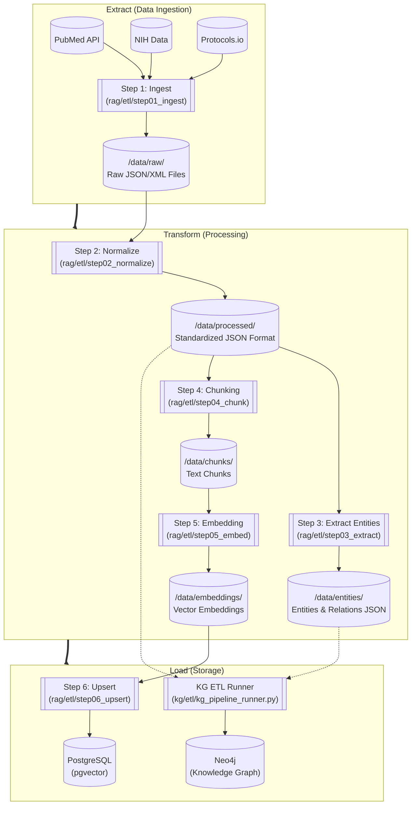
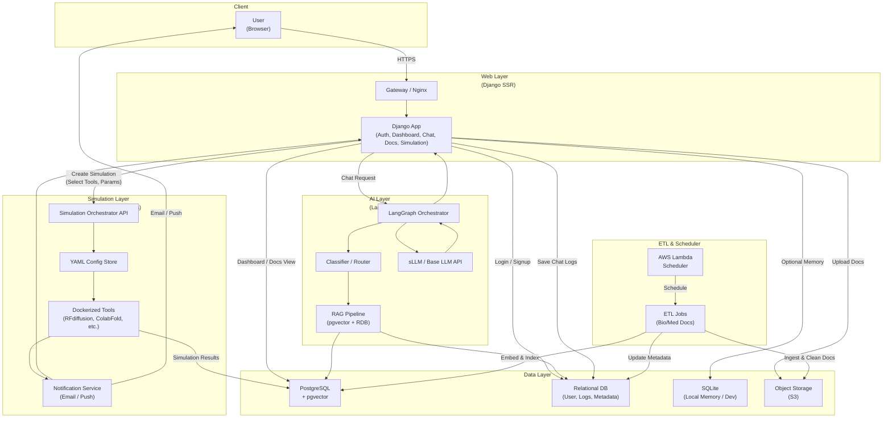
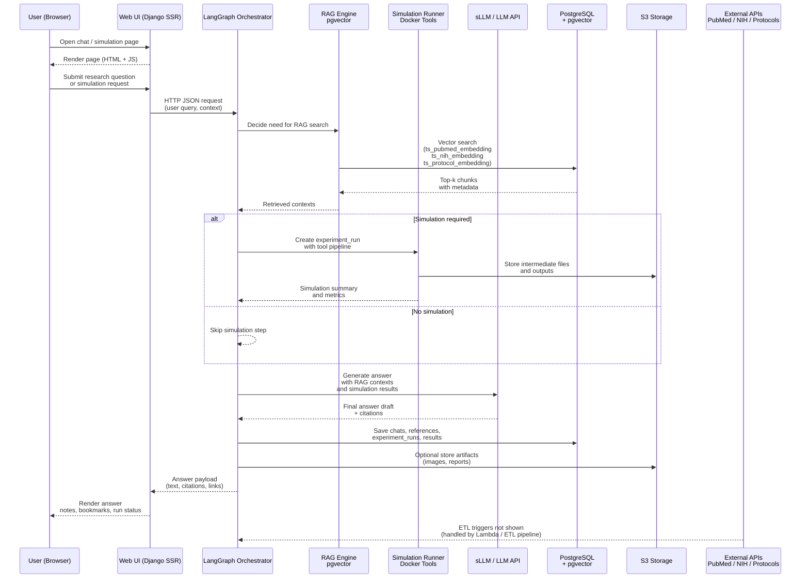

# SKN18-Final-2Team

## [2팀]

| 이름    | 역할   | 세부 역할 |   
|:------: |:-----: |:-------------------: |  
| 황혜진  | PM   | PM, WEB, Infra  |   
| 황민우  | APM   | APM, GraphDB, WEB |   
| 김주석  | 팀원   | 데이터 수집, 전처리, RAGAs |   
| 임승옥  | 팀원   | 데이터 총괄 |    
| 정인하  | 팀원   | LangGraph, sLLM, WEB |   
| 최준호  | 팀원   | 데이터 수집, 전처리 | 

## [주제]

### **🧬 HelixOps**
 > Bio/Med R&D Agentic Platform<br/>
 > 자체 sLLM 개발을 통한 기업 업무 활용 생성형 AI 플랫폼

### 📌 서비스 개요
바이오/제약 기업의 신약 개발 및 연구팀을 대상으로 **문헌 탐색 → AI 기반 후보물질 발굴/시뮬레이션 → 실험 설계 → 실험 결과 해석**의 R&D 전주기를 지원하는 플랫폼입니다. 
논문 내 실험 결과와 이미지 캡션을 학습한 sLLM으로 실험 데이터의 전문적 해석을 자동화하고, AI 예측 및 시뮬레이션 파이프라인과 Hybrid RAG를 하나의 워크스페이스에 통합하여 연구 효율성을 극대화합니다

### **✔ 핵심 목표**
* **최신 논문·임상·프로토콜 기반**의 신뢰 가능한 답변 제공  
* 반복적이고 시간이 많이 드는 문헌 검색·근거 비교 프로세스를 자동화  
* 의료 연구자·의사·대학원생들이 **임상적 판단 근거**를 빠르게 확보할 수 있도록 지원  
* RAG + LangGraph 기반으로 **추론 품질, 신뢰성, 근거 재현성**을 확보  
* PubMed·NIH·Protocols\.io 데이터를 **ETL 파이프라인**으로 구조화
* Neo4j 기반 검색 인프라를 통해 확장 가능한 **연구 지식 데이터 레이크** 구축

### 🎯 타겟 사용자
* Researcher : 의료·바이오 연구자
* Physician Scientist : 신약·비임상 분야 임상의 및 연구 의사
* Medical / Bio Grad Student : 의과대학·생명과학 분야 대학원생
* Clinical Trial Coordinator : 임상시험 및 비임상 연구 코디네이터

### 🎯 타겟 요구사항
* 최신 논문·임상시험·프로토콜을 단일 인터페이스에서 신속히 탐색하고, 출처가 명확한 근거 중심 답변을 필요로 함.
* 논문 구조(Background–Methods–Results–Conclusion) 요약, 연구방법·통계 해석, 발표/보고서용 단계별 요약과 후속 질문 자동 생성 기능이 필요함.
* Eligibility 조건, Inclusion/Exclusion, ECOG·Lab cutoff·Dose/Endpoint 등 핵심 기준을 정확히 정규화·추출해 비교 가능하게 제공하길 요구함.
* 특정 biomarker / target / outcome 기준으로 연관 연구를 교차 검색하고, 근거 스니펫 인용·비교 표 형태로 정리해주길 원함.
* 실험 설계·프로토콜 초안 생성과 결과 해석에 있어 재현 가능한 근거 링크와 버전 관리가 필요함.
* 근거 스니펫과 구조화된 전처리 결과를 입력으로 받아 관찰 기반·비기전적 응답을 생성하는 도메인 특화 SLLM이 필요함.

## [프로젝트 구조]

```text  
SKN18-FINAL-2TEAM/
├─ README.md
├─ docker-compose.yml               # postgreSQL, pgvector (infra/db/init.sql)
├─ docker-compose.prod.yml
├─ requirements.txt
├─ .env.example
│
├─ .github/
│  └─ workflows/
│     ├─ deploy.yml                 # 🔹 GitHub → ECR → EC2 자동배포
│     └─ ...
│
├─ infra/                           # 인프라/배포 관련
│  ├─ docker/
│  ├─ aws/
│  │  ├─ lambda_functions/
│  │  ├─ cloudformation/
│  │  └─ terraform/
│  ├─ nginx/
│  ├─ neo4j/                       # Neo4j 설정
│  └─ cicd/                        # 🔹 CI/CD 부가 스크립트
│
├─ django_app/                      # Django SSR + API
│  ├─ manage.py
│  ├─ config/                       # settings, urls, wsgi, asgi
│  ├─ apps/
│  │  ├─ accounts/                  # 로그인/회원가입
│  │  ├─ core/
│  │  ├─ dashboard/                 # 메인 대시보드
│  │  ├─ chat/                      # LangGraph 기반 챗봇
│  │  ├─ docs/                      # 문서 관리
│  │  ├─ experiments/               # 실험 시뮬레이션(YAML) 저장/관리
│  │  ├─ notifications/             # 이메일/푸시
│  │  └─ api/                       # REST API (선택)
│  ├─ templates/
│  │  ├─ base.html
│  │  └─ ...
│  ├─ static/
│
├─ graph/                           # LangGraph 오케스트레이션
│  ├─ state.py
│  ├─ nodes/
│  │  ├─ classifier.py              # 질문 분류
│  │  └─ ...
│  └─ entrypoints/
│
├─ rag/                             # RAG + pgvector (문서/논문 기반)
│  ├─ config/
│  │  ├─ db_pgvector.sql
│  │  └─ schema_diagram.md
│  │  
│  ├─ etl/
│  │  ├─ 01_ingest/                         # 1단계: 데이터 "긁어오기"
│  │  ├─ 02_normalize/                     # 2단계: 소스별 raw → 공통 포맷
│  │  ├─ 03_extract/                       # 3단계: 엔터티/관계 추출 (KG용, 선택이지만 중요)
│  │  ├─ 04_chunk/                         # 4단계: 청킹
│  │  ├─ 05_embed/                         # 5단계: 임베딩
│  │  ├─ 06_upsert/                        # 6단계: DB 적재
│  │  ├─ common/                           # ETL 공통 util 모음
│  │  │  ├─ loaders.py                     # raw/processed 파일 로드/저장
│  │  │  └─ ...
│  │  └─ pipeline_runner.py                # 전체 ETL 실행 entrypoint
│  ├─ embeddings/
│  ├─ jobs/
│  └─ tests/
│
├─ kg/                              # Neo4j 기반 Knowledge Graph
│  ├─ schema/
│  │  ├─ nodes.md                   # Protein / Disease / Experiment …
│  │  ├─ relationships.md
│  │  └─ constraints.cypher
│  ├─ etl/
│  │  ├─ 01_from_rag_docs/                   # rag/etl 결과를 입력으로 받는 단계
│  │  │  ├─ 01_load_normalized_docs.py      # rag/etl/02_normalize 결과 로딩
│  │  │  └─ 02_build_base_nodes.py          # Paper / Trial / Protocol 노드 생성
│  │  │
│  │  ├─ 02_from_rag_entities/              # rag/etl/03_extract 결과를 Graph로
│  │  │  ├─ 01_load_entities.py             # _entities.json 로딩
│  │  │  └─ 02_upsert_entities_relations.py # Protein, Disease, 관계 upsert
│  │  │
│  │  ├─ 03_from_sim_results/               # 시뮬레이션 결과 → KG 반영
│  │  │  ├─ 01_load_sim_results.py          # sim_tools 결과 로딩
│  │  │  └─ 02_link_protein_experiment.py   # (Protein)-[HAS_SIM_RESULT]->(Experiment)
│  │  │
│  │  ├─ 04_maintenance/                    # 그래프 유지보수/정리
│  │  │  ├─ 01_apply_constraints.py         # constraints.cypher 실행
│  │  │  └─ 02_recompute_graph_metrics.py   # centrality, degree 등 (선택)
│  │  │
│  │  ├─ common/
│  │  │  ├─ neo4j_client.py                 # Bolt 연결, 세션 관리
│  │  │  ├─ cypher_templates.py             # MERGE, MATCH 쿼리 템플릿
│  │  │  └─ mapping.py                      # internal_doc_format → node schema 매핑
│  │  │
│  │  ├─ kg_pipeline_runner.py              # KG용 전체 파이프 entrypoint
│  │  └─ README_kg_etl.md
│  │
│  ├─ queries/
│  │  ├─ path_queries.cypher
│  │  ├─ analytics.cypher
│  │  └─ graph_analytics.py
│  ├─ src/                                  # KG 관련 유틸리티 및 데이터 로더
│  │  ├─ data_loader.py
│  │  ├─ db_connector.py
│  │  └─ queries.py
│  ├─ vector_search/                        # 벡터 검색 실험 및 평가
│  │  ├─ eval_ab_v5.py
│  │  └─ run_system_a_patched_v4.py
│  └─ tests/
│
├─ sim_tools/                       # 시뮬레이션 도커 툴
│  ├─ base/
│  │  ├─ Dockerfile
│  │  └─ requirements.txt
│  │
│  ├─ alphafold3/
│  │  ├─ Dockerfile
│  │  ├─ config.yml
│  │  ├─ run.sh
│  │  └─ src/main.py
│  │
│  ├─ protein_mpnn/
│  │  ├─ Dockerfile
│  │  ├─ config.yml
│  │  ├─ run.sh
│  │  └─ src/main.py
│  │
│  ├─ rfdiffusion/
│  │  ├─ Dockerfile
│  │  ├─ config.yml
│  │  ├─ run.sh
│  │  └─ src/main.py
│  │
│  └─ common/
│     ├─ io.py
│     ├─ pdb_utils.py
│     └─ types.py
│
├─ sllm/                            # 도메인 특화 LLM (sLLM)
│  ├─ configs/
│  │  ├─ finetune_bio_med.yaml
│  │  └─ inference.yaml
│  ├─ datasets/                     # SFT 멀티턴 QA / 실험 시나리오
│  │  ├─ train/
│  │  └─ eval/
│  ├─ training/
│  │  ├─ preprocess_to_sft.py
│  │  ├─ run_finetune.py
│  │  └─ experiment.ipynb
│  ├─ inference/
│  │  ├─ client_vllm.py
│  │  ├─ client_ollama.py
│  │  └─ router.py
│  └─ tests/
│
├─ jobs/                             # 백그라운드/배치 작업 (서버 사이드)
│  ├─ manage_etl.py                  # Django context + ETL 호출
│  ├─ check_sim_status.py            # 시뮬레이션 컨테이너 상태 체크 후 RDB 업데이트
│  └─ send_notifications.py          # 이메일/푸시 발송 (Lambda에서 호출 가능)
│
├─ scripts/                          # 개발 편의 스크립트
│  ├─ dev_up.sh                      # docker-compose up + migrate
│  ├─ prune_images.sh
│  └─ migrate.sh
│
├─ data/                             # 원천/가공 데이터, 로컬만 (운영에서는 S3)
│  ├─ raw/
│  └─ processed/
│
└─ assets/                           # ERD, Mermaid, 아키텍처 이미지
   └─ architecture/
```

## [도구/기술]

#### **Environment**  
  
  
  


#### **Development**  
  
  
  
  

#### **Database / Infrastructure**  
  
  
  

#### **Communication**  


## [요구사항]

**1️⃣ 데이터 수집 및 전처리 모듈**
- PubMed·NIH·Protocols.io 등 외부 소스에서 문헌/프로토콜 데이터를 안정적으로 수집하고, RAG/분석에 적합한 정제 텍스트로 변환한다.
- 소스별 포맷 차이를 internal_doc_format으로 정규화하고, 중복 제거·클린징·메타데이터(출처/날짜/섹션/키워드) 보존을 보장한다.
- 수집/전처리 결과는 S3에 success/fail + source + date + stage 파티션 구조로 저장하며, fail 데이터는 알림/재처리 대상이 된다.

**2️⃣ 질의 응답 플로우 설계 및 구축 (LangGraph 기반 오케스트레이션)**
- 사용자의 질문을 일관된 흐름으로 처리하기 위해 LangGraph 기반 워크플로우를 설계한다.
- 질문 1건당 하나의 “추론 파이프라인”으로 실행되며, 핵심 노드는 아래 순서를 따른다:
- 메모리 로드 → 질문 분류(논문/임상/프로토콜/결과 해석) → 용어/단위 판별 → RAG 검색(pgvector) → (선택) 그래프 탐색(Neo4j) → 근거 검증/정합성 체크 → 답변 생성(sLLM/LLM) → 인용 스니펫/출처 링크 포함 → 메모리 기록 → 답변 출력
- 답변은 근거 기반(출처/스니펫)으로 제공하며, 후속 질문 추천 및 비교 요약(여러 근거 간 차이) 기능을 포함한다.

**3️⃣ RAG ETL 파이프라인 (pgvector 기반)**
- 정규화된 문서를 청킹(섹션/토큰/오버랩)하고 임베딩을 생성하여 pgvector 인덱스로 업서트하는 ETL 파이프라인을 구축한다.
- ETL 단계는 ingest → normalize → (선택) extract → chunk → embed → upsert로 구성하며, 운영 환경에서는 Lambda를 단계/소스별로 분리 실행할 수 있어야 한다.
- 벡터 검색 품질을 위해 chunk 품질 평가, 인덱스 리빌드, 재처리(run_id 기반) 및 버전 관리(embedding model/version)를 지원한다.

**4️⃣ 웹 UI & 시각화 (Django SSR + JS)**
- 연구자/의사가 사용할 수 있는 웹 UI를 제공하며, “대화 + 근거 + 문서 미리보기 + 요약/비교 결과”를 한 화면에서 확인 가능하게 한다.
- 주요 화면: 채팅(근거 하이라이트/출처 링크), 문서/프로토콜 탐색, 임상시험 요약(Eligibility/Outcome 구조화), 실험 결과 해석(초안/검증 포인트), 히스토리/북마크.
- 관리 기능: 데이터 적재 현황, ETL 성공/실패 로그, 모델 버전, 인덱스 상태, 재처리 트리거 제공.

**5️⃣ 관측·품질·로그 (Observability & Quality Tracking)**
- 질문→검색→답변 전 과정을 추적 가능하게 하여 “어떤 질문에 어떤 근거로 어떤 답이 나갔는지”를 재현할 수 있어야 한다.
- 품질 지표(논리성/정확성 점수, 근거 일치도, hallucination 의심 신호)와 운영 지표(ETL 처리량/실패율/시간, Lambda 실행 시간, 비용)를 기록한다.
- 실패(fail prefix) 데이터는 자동 알림(Slack/Discord/SNS)과 재처리 워크플로우로 연결되며, 단계별 원인(ingest/normalize/chunk/embed/upsert)을 구분해 대응할 수 있어야 한다.

**6️⃣ SLLM (Scientific LLM) 모듈**
- RAG 및 그래프 탐색 결과(문서 스니펫, 메타데이터, 출처 링크, 관계 정보)를 입력으로 받아 근거 기반 응답을 생성하며, 제공된 근거 범위를 벗어난 추론은 제한한다.
- 실험 결과 해석 시 수치, 비교, 유의성 등 관찰 가능한 정보 중심으로 요약하며, 기전·인과·임상적 해석은 데이터에 명시된 경우에만 기술한다.
- 모든 주요 출력에는 출처 및 스니펫을 연결하고, 근거 부족 또는 상충 시 이를 명시하고 추가 확인 포인트를 제시한다.


## [수집 데이터]
**1. PubMed 논문 전문 및 메타데이터**
- Source: PMC (PubMed Central) Open Access Subset
- URL: https://pmc.ncbi.nlm.nih.gov/tools/oai/
- Format: JSON
- Description:
   PubMed Open Access 논문 전문 및 메타데이터를 수집하여 RAG 학습 및 검색에 활용한다.
   제공된 분류 체계를 기반으로 키워드를 확장하여 키워드별 약 200편의 논문을 수집한다.
- Target Domains:
  1) Protein Structure & Enzyme Engineering
  2) Cancer Biology & Oncology
  3) AI-based Modeling & Design
  4) Cell & Molecular Mechanisms
  5) Omics & Systems Biology

**2. Experimental Protocols**
- Source: Protocols.io API
- API Endpoints:
  - v3: https://www.protocols.io/api/v3/protocols
  - v4: https://www.protocols.io/api/v4/protocols/{protocol_id_or_uri}
- Format: CSV
- Description:
   - 실험 프로토콜 메타데이터(v3)와 상세 실험 절차(v4)를 단계(step), 시약·장비 정보, HTML 본문 형태로 수집한다.
   - 문헌 기반 실험 재현성과 프로토콜 이해를 지원하기 위한 데이터 소스이다.

**3. Clinical Trials**
- Source: ClinicalTrials.gov (National Library of Medicine)
- URL: https://clinicaltrials.gov/data-api/api#refs
- Format: JSON
- Description:
   - 2023–2025년 기간 동안 한국·미국·일본의 주요 질환군에 대한 임상시험 데이터를 수집하여 Eligibility 조건, Outcome, Trial Design 분석에 활용한다.
- Coverage:
   Diseases: Neoplasms, Autoimmune Diseases, Cardiovascular Diseases
- Countries & Volume:
   - Korea: 약 3,584 cases
   - United States: 약 31,884 cases
   - Japan: 약 2,450 cases
  
**4. Knowledge Graph (PrimeKG)**
- Source: mims-Harvard / PrimeKG
- URL: https://github.com/mims-harvard/PrimeKG
- Format: CSV / TSV
- Description:
   - 대규모 생의학 논문과 공개 데이터베이스를 기반으로 구축된 질병–약물–유전자–경로 관계형 지식 그래프이다.
   - 논문 기반 근거를 구조화하여 관계 추론과 탐색이 가능하도록 제공한다.
- Purpose:
  - 논문 기반 질병·약물·유전자 간 관계 추출 및 근거 중심 분석
- Strategy:
  - PrimeKG 엔티티·관계 데이터를 Neo4j Knowledge Graph로 Import하여 그래프 탐색 및 추론에 활용
- Use Cases:
   - 연구 근거 탐색 및 가설 수립
   - 타겟–질병–약물 관계 분석
   - 실험 설계 및 후보 타겟 우선순위 도출

## [화면 설계]

- **도구** : Figma, HTML, CSS, Javascript


# [설계]

## 1. ETL



## 2. **시스템 구성 및 흐름도**



- 시퀀스 다이어그램(Sequence Diagram)


## [구현]

### 1. Hybrid RAG
 - **목적**: Bio/Med 연구자의 질문을 논문·임상·프로토콜 근거로 답변하고, 관계 추론(KG)까지 한 번에 실행하는 하이브리드 검색/생성 파이프 구축

 - **결과**: LangGraph 플로우에서 Neo4j(Graph + VectorDB)를 LLM이, Cross-Encoder 재순위화·LLM 필터링·웹 검색 백업까지 거친 근거 기반 답변을 Django UI에 제공한다.  

#### 1-1) ETL
  - ingest → normalize → extract → chunk → embed → upsert 단계로 PubMed/NIH/Protocols.io를 정규화 한 뒤에 VectorDB에 적재한다.
  - KG(knowledge Graph) 연계를 위해 엔티티/관계 추출 결과를 Neo4j 노드 & 엣지로 동기화하며, 시뮬레이션 결과도 반영한다.

#### 1-2) Database (Graph + VectorDB)  
- **Graph DB**: Neo4j로 그래프를 구성하고 TextRetriever 인덱스와 Cypher 템플릿으로 관계 기반 검색을 수행한다.


- **Vector DB**: 문서·청크·임베딩을 저장하며 OpneAI text-embedding-3-Small 모델과 로컬 SentenceTransformer 임베딩으로 검색한다.  
  

#### 1-3) retriver(검색)  
- **역할**: 사용자 질문을 분석하고, Neo4j에서 하이브리드 검색을 수행하여 관련 컨텍스트를 추출하는 RAG 검색 파이프라인
- **검색방식**: 
  - **Query Rewrite**: LLM이 질문을 정규화하고 Track(T1~T4), Intent, Domain을 결정하며 MUST/SHOULD/MUST_NOT 키워드를 추출
  - **Query Router**: Track/Intent/Domain에 따라 검색 계획(Retrieval Plan) 수립 (Entity 검색 vs Hybrid 검색)
  - **Embedding Router**: 도메인별 임베딩 생성 (Paper/Clinical: OpenAI text-embedding-3-small 1536차원, Protocol: BAAI/bge-m3 1024차원)
  - **Hybrid Search**: Neo4j에서 벡터 검색과 키워드 검색을 RRF(Reciprocal Rank Fusion)로 결합하여 하이브리드 점수 계산
  - **Entity Search**: Fulltext로 Entity 해석 후 Track별 Cell 쿼리로 Paper/Protocol/Clinical/KG 정보 조립
  - **Cross-Encoder Rerank**: ms-marco-MiniLM-L-6-v2 모델로 검색 결과의 관련성을 재평가하여 상위 K개 선택
  - **다중 도메인 지원**: Paper, Protocol, Clinical, KG를 통합 검색하며 Track 기반으로 최적화된 검색 전략 적용

#### [RAG 시스템 아키텍처]

```
┌─────────────────────────────────────────────────────────┐
│                    사용자 질문 (Question)               │
└──────────────────────────┬──────────────────────────────┘
                           │
                           ▼
┌─────────────────────────────────────────────────────────────┐
│  1. Query Rewrite Node                                      │
│     - LLM 기반 질문 정규화 및 분석                          │
│     - Track/Intent/Domain 결정                              │
│     - MUST/SHOULD/MUST_NOT 키워드 추출                      │
└──────────────────────────┬──────────────────────────────────┘
                           │
                           ▼
┌─────────────────────────────────────────────────────────────┐
│  2. Query Router Node                                       │
│     - Track/Intent 기반 검색 계획 수립                      │
│     - 도메인별 우선순위 결정                                │
│     - Retrieval Plan 생성                                   │
└──────────────────────────┬──────────────────────────────────┘
                           │
                           ▼
┌─────────────────────────────────────────────────────────────┐
│  3. Embedding Router Node                                   │
│     - Paper/Clinical: OpenAI text-embedding-3-small (1536)  │
│     - Protocol: BAAI/bge-m3 (1024)                          │
└──────────────────────────┬──────────────────────────────────┘
                           │
                           ▼
┌─────────────────────────────────────────────────────────────┐
│  4. Retriever Executor                                      │
│     - RAG Orchestrator 호출                                 │
│     - 도메인별 Hybrid Search 실행                           │
│     - Entity 기반 검색 실행                                 │
└──────────────────────────┬──────────────────────────────────┘
                           │
                           ▼
┌─────────────────────────────────────────────────────────────┐
│  5. RAG Orchestrator                                        │
│     - Neo4j Hybrid Search 쿼리 실행                         │
│     - RRF 기반 점수 통합                                    │
│     - Cell 쿼리로 결과 조립                                 │
└──────────────────────────┬──────────────────────────────────┘
                           │
                           ▼
┌─────────────────────────────────────────────────────────────┐
│  6. Cross-Encoder Rerank                                    │
│     - ms-marco-MiniLM-L-6-v2 모델 사용                      │
│     - Query-Document 관련성 재평가                          │
│     - 상위 K개 선택                                         │
└──────────────────────────┬──────────────────────────────────┘
                           │
                           ▼
┌─────────────────────────────────────────────────────────────┐
│                    최종 검색 결과 (Contexts)                │
└─────────────────────────────────────────────────────────────┘
```

#### [주요 특징]
#### (1) Query Rewrite (`query_rewrite_node.py`)

**목적**: 사용자 질문을 분석하고 검색에 최적화된 형태로 변환

**주요 기능**:
- **Track 분류**: T1(정의), T2(근거 검색), T3(비교/추천), T4(종합)
- **Intent 분류**: evidence_search, protocol_search, clinical_search, multi_domain
- **Domain 감지**: paper, protocol, clinical, kg
- **키워드 추출**:
  - `must`: 필수 키워드 (1~3개, 고유명사/타겟/약물 등)
  - `should`: 보조 키워드 (5~15개, 동의어/약어 확장)
  - `must_not`: 제외 키워드 (0~5개, 동음이의어 제거)
- **Entity 추출**: 생물의학 엔티티 (단백질, 유전자, 질병, 약물 등)

**출력 예시**:
```json
{
  "track": "T2",
  "intent": "evidence_search",
  "domains": ["paper"],
  "normalized_question": "What is the efficacy of pembrolizumab in NSCLC?",
  "entities": [
    {"name": "pembrolizumab", "type": "drug"},
    {"name": "NSCLC", "type": "disease"}
  ],
  "must": ["pembrolizumab", "NSCLC"],
  "should": ["PD-1", "non-small cell lung cancer", "Keytruda"],
  "must_not": [],
  "retrieval": {
    "k_seed": 300,
    "k_final": 40,
    "hop_limit": 2,
    "fanout_limit": 200
  }
}
```

#### (2) Query Router (`query_router.py`)

**목적**: Track/Intent/Domain에 따라 검색 계획(Retrieval Plan) 수립

**라우팅 규칙**:

| Track | Intent | 우선순위 | 검색 전략 |
|-------|--------|---------|----------|
| T1 | - | 10 | Entity 검색 → Fulltext → Hybrid (fallback) |
| T2 | evidence_search | 15 | Hybrid Search (도메인별) |
| T3 | - | - | Entity 기반 비교/추천 검색 |
| T4 | multi_domain | 5 | Entity → KG → Paper/Protocol/Clinical Hybrid |

**Retrieval Plan 예시**:
```json
[
  {
    "domain": "paper",
    "mode": "HY",
    "embedder": "main_1536",
    "priority": 15,
    "why": "default paper hybrid"
  },
  {
    "domain": "protocol",
    "mode": "HY",
    "embedder": "protocol_1024",
    "priority": 17,
    "why": "T4: protocol hybrid (1024)"
  }
]
```

#### (3) Embedding Router (`embedding_router.py`)

**목적**: 검색 계획에 필요한 임베딩 생성

**임베딩 모델**:
- **Paper/Clinical**: `text-embedding-3-small` (OpenAI, 1536차원)
- **Protocol**: `BAAI/bge-m3` (Hugging Face, 1024차원)

**Lazy Loading**: Protocol 임베딩은 최초 호출 시에만 Hugging Face API 연결

#### (4) Retriever Executor (`retriever_runner.py`)

**목적**: 검색 계획을 실행하여 컨텍스트 수집

**실행 흐름**:
1. Retrieval Plan의 각 단계를 순차 실행
2. 도메인별 Orchestrator 메서드 호출
3. 결과 중복 제거 (chunk_id 기반)
4. 최종 contexts 반환

#### (5) RAG Orchestrator (`rag_orchestrator.py`)

**목적**: Neo4j에서 실제 검색 쿼리 실행 및 결과 조립

#### (5.1) Hybrid Search (`route_by_hybrid_search`)

**RRF (Reciprocal Rank Fusion) 알고리즘**:
```
hy_score = vec_score + ft_score
```

**파라미터**:
- `k_seed`: 초기 검색 후보 수 (기본 150)
- `k_final`: 최종 반환 개수 (기본 100)
- `k_vec`: RRF용 벡터 후보 (기본 80)
- `k_ft`: RRF용 키워드 후보 (기본 80)
- `rrf_k0`: RRF 상수 (기본 60)

**Fallback 전략**: `must_terms`로 결과가 없으면 조건 완화 후 재검색

#### (5.2) Entity Search (`route_by_entity`)

**흐름**:
1. Fulltext로 Entity 해석 (Entity ID 획득)
2. Track에 따라 Cell 쿼리 선택:
   - T1: PAPER_T1 / PROTOCOL_T1 / CLINICAL_T1
   - T3: PAPER_T3 / PROTOCOL_T3 / CLINICAL_T3
   - T4: PAPER_T4 / PROTOCOL_T4 / CLINICAL_T4

#### (6) Cross-Encoder Rerank (`rerank.py`)

**목적**: 검색 결과의 관련성을 정밀하게 재평가

**모델**: `cross-encoder/ms-marco-MiniLM-L-6-v2`
- Query와 Document를 동시에 입력하여 관련성 점수 계산
- Bi-Encoder보다 정확하지만 느림 (재순위화 단계에서만 사용)

속도와 정확도 트레이드오프:

| 모델 | 속도 | 정확도 | 권장 용도 |
|------|------|--------|----------|
| ms-marco-TinyBERT-L-2-v2 | ⚡⚡⚡ | ⭐⭐ | 빠른 프로토타입 |
| ms-marco-MiniLM-L-6-v2 | ⚡⚡ | ⭐⭐⭐ | **현재 사용** (균형) |
| ms-marco-electra-base | ⚡ | ⭐⭐⭐⭐ | 높은 정확도 필요 |
| ms-marco-MiniLM-L-12-v2 | ⚡ | ⭐⭐⭐⭐⭐ | 최고 정확도 |

**사용 위치**: `graph/nodes/retriver.py`의 `retriever_bio_node`에서 호출


#### [데이터베이스 구조]

#### Neo4j 통합 데이터베이스

HybridRAG는 **Neo4j**를 단일 데이터베이스로 사용합니다:
- **Graph DB**: 엔티티, 관계, 메타데이터 저장
- **Vector DB**: pgvector 대신 Neo4j Vector Index 사용
- **Fulltext Index**: Lucene 기반 키워드 검색

#### 주요 노드 타입

##### Paper 도메인
- `Article`: 논문 메타데이터 (pmid, title, year, abstract)
- `Section`: 논문 섹션 (Introduction, Methods, Results 등)
- `Chunk`: 논문 텍스트 청크 (벡터 임베딩 포함, 1536차원)
- `Entity`: 생물의학 엔티티 (단백질, 유전자, 질병 등)
- `Mention`: 텍스트에서 추출된 엔티티 언급

##### Protocol 도메인
- `Protocol`: 프로토콜 메타데이터 (title, usage_degree)
- `ProtocolChunk`: 프로토콜 텍스트 청크 (벡터 임베딩 포함, 1024차원)
- `Experiment`: 실험 방법 및 설정
- `ExpMaterial`: 실험 재료
- `ExpEquipment`: 실험 장비

##### Clinical 도메인
- `ClinicalTrial`: 임상시험 메타데이터 (nct_id, phase, title)
- `ClinicalChunk`: 임상시험 텍스트 청크 (벡터 임베딩 포함, 1536차원)

##### Knowledge Graph
- `BaseNode`: PrimeKG 노드 (유전자, 단백질, 질병 등)
- 관계: `MAPS_TO_PRIMEKG`, `REFERS_TO`

#### 1-4) evaluation
- **역할**: HybridRAG 시스템의 검색 품질과 신뢰성을 평가하여 기존 RAG 대비 개선 효과를 측정

- **Golden Dataset 구축 및 신뢰성**:
  
  - **데이터셋 구축 방법**:
    - **RAGAS의 합성 데이터 생성(Synthetic Test Data Generation) 모듈** 활용
    - 보유한 전문 문서를 입력하여, 단순 질문뿐만 아니라 추론이 필요한 복합 질문까지 포함된 고품질의 '질문-정답(Ground Truth) 쌍'을 자동 생성
    - 인간의 편향(Bias)을 배제한 객관적인 Golden Dataset 확보
  - **평가 방법**:
    - 생성된 데이터셋을 기반으로 RAGAS와 G-Eval을 통해 정량적·정성적 평가 수행
    - Context Recall(재현율)과 Answer Correctness(정답 일치율)가 획기적으로 개선됨을 수치로 확인
    - **AI가 문제를 내고(데이터 생성), AI가 채점하는(평가)** 고도화된 검증 시스템 구축

- **평가 지표 및 결과**:
  **1. Hallucination 감소** (평가 도구: RAGAS Framework)
  - **근거 없는 문장 비율 (Faithfulness)**:
    - 일반 RAG: 32% → HelixOps: 8%
    - RAGAS의 Faithfulness 지표로 측정: 생성된 답변이 검색된 문서(Context)에 있는 내용만으로 구성되었는지(Hallucination 여부)를 수치화
  - **출처 누락 (Context Recall)**:
    - 일반 RAG: 41% → HelixOps: 5%
    - RAGAS의 Context Recall 지표와 연관: 정답(Golden Set)을 생성하기 위해 필요한 핵심 문구가 검색 결과에 포함되었는지 평가

  **2. Answer Consistency** (평가 도구: G-Eval (LLM-as-a-Judge))
  - **5회 질문 결론 유지율**:
    - 일반 RAG: 62% → HelixOps: 91%
    - 같은 질문을 5번 던진 뒤, 나온 5개의 답변을 G-Eval(GPT-4)에게 주고 "이 답변들의 핵심 결론이 논리적으로 일치하는가?"를 채점
    - 단순 텍스트 유사도(Similarity)보다 훨씬 정확한 '논리적 일관성(Logical Consistency)' 평가 방식

  **3. Evidence Coverage** (평가 도구: System Trace (로그 분석) & Graph Metrics)
  - **평균 인용 문서 수**:
    - 일반 RAG: 1.2개 → HelixOps: 3.6개
    - 시스템 로그(Trace Log)를 분석하여 1회 답변 생성 시 Retriever가 가져온 Chunk의 개수를 평균 낸 수치

  - **그래프 경로 수**:
    - 일반 RAG: 0개 → HelixOps: 3-5개
    - Graph DB에서 탐색한 Hop의 깊이(Depth) 및 경로(Path) 수를 평균 낸 수치

  **4. Re-rank 효과** (평가 도구: Golden Dataset 기반 IR(정보검색) 평가)
  - **Top-3 Precision**:
    - Before: 40% → After: 76%
    - 구축한 Golden Dataset(정답지)을 기준으로, Re-ranker를 거친 후 상위 3개 문서 안에 실제 정답 문서가 포함되어 있는지를 계산
    - RAGAS의 Context Precision과 동일한 개념

---

### 2. LangGraph
- **역할** : **전체 AI 파이프라인을 오케스트레이션(orchestration)** 하는 핵심 엔진 (운영, 실험, 안전, 재시도 등)
- **목적**:  
  `langgraph` 워크플로우로 생물학 특화 Self-RAG 파이프라인을 구성해 질문 유형에 따라 사용자 정보·비의학·의학 질문을 자동 라우팅하고, BIO_Q는 RAG 검색, PROTOCOL_Q는 보안을 고려한 로컬 임베딩 기반 RAG 검색, 관련성이 낮은 경우 WebSearch로 보내도록 설계
- **워크플로우 :** 가드레일 → 질문 분류 → 메모리 읽기 → 쿼리 재작성 → 검색 → 재순위화 → 평가 → 웹 검색(필요시) → 답변 생성 → 메모리 기록
- **노드 별 기능**  
  - **guardrail_input** : 입력 안전성 검사 (불법/위험 질문 차단)
  - **classify_agent** : 사용자의 질문을 USER_INFO, NO_RELATION, BIO_Q, SIMULATION_Q, PROTOCOL_Q, INFERENCE_Q로 분류
  - **memory_read** : PostgreSQL에 저장된 기존 대화내역 전달(케이스 타입별 최대 5개, 꼬리질문 감지 시 원본 질문 타입 기준으로 조회)
  - **query_rewrite_agent** : 검색 성능 향상을 위해 LLM이 질문을 재작성
  - **retriever_bio_node** : BIO_Q용 - OpenAI 임베딩(text-embedding-3-large) 사용
  - **retriever_protocol_node** : PROTOCOL_Q용 - 로컬 임베딩(sentence-transformers/all-MiniLM-L6-v2) 사용, 보안 고려
  - **rerank** : Cross-Encoder(ms-marco-MiniLM-L-6-v2)로 검색 결과 재순위화
  - **bio_evaluate_chunk_node** : BIO_Q용 - 추출된 청크가 원본 질문과 연관성이 있는지 GPT-4o-mini가 판단하여 점수 부여, 관련성이 낮으면 웹 검색으로 이동
  - **protocol_evaluate_chunk_node** : PROTOCOL_Q용 - 추출된 청크가 원본 질문과 연관성이 있는지 로컬 sllm이 판단하여 점수 부여
  - **web_search** : Tavily를 사용해 의학 용어 정의 및 최신 정보 검색 (BIO_Q에서 RAG 검색 실패 시 fallback)
  - **evaluate_web** : 웹 검색 결과의 관련성 평가
  - **generate_answer** : 케이스 타입별 답변 생성 (USER_INFO는 친근한 응답, BIO_Q/PROTOCOL_Q는 RAG/웹 결과 기반, SIMULATION_Q는 시뮬레이션 경로 안내, INFERENCE_Q는 실험 결과 해석), 출처 추출
  - **memory_write** : 질문과 Generate_answer에서 생성된 답변과 summary, 채팅방 아이디(conversation_id)를 PostgreSQL에 저장

- **핵심 전략**
  - **멀티턴 대화 전략 - 똑똑한 메모리 관리**
    - 일반적인 챗봇과 달리, 질문 유형별로 대화를 분리해 기억
    - 타입별 슬롯 메모리: BIO_Q, PROTOCOL_Q, USER_INFO 등 각 유형의 대화를 따로 저장
    - 꼬리질문 자동 감지: Classify 노드에서 '이전 질문과 연결된 질문인가?'를 판단
    - 선택적 히스토리 로드: 현재 질문과 같은 타입의 최근 5개 대화 요약만 불러옴
    - LLM 기반 요약: 긴 대화를 '~질문에 대한 응답으로 ~다' 형식으로 500자 이내 3줄 요약 저장
    - 왜 이렇게? → 전체 대화를 다 기억하면 속도도 느리고 맥락이 섞임. 질문 유형별로 나누면 정확하고 빠른 답변 가능

  - **보안 전략 - 민감 정보 보호**
    - 특히 실험 프로토콜은 기업의 핵심 보안 실험 자산과 밀접한 관련이 있어, 질문 유형에 따라 다른 보안 수준 적용
    - 보안이 필요한 경우, 응답하는 LLM을 SLLM으로 사용할 뿐만 아니라 사용자 질문을 임베딩하는 모델도 로컬 모델 사용
    - BIO_Q: OpenAI text-embedding-3-large 사용
      - 일반적인 생물학 논문 및 임상실험 검색은 외부 API 활용
    - PROTOCOL_Q: sentence-transformers/all-MiniLM-L6-v2 로컬 임베딩 모델 사용
      - 민감한 실험 프로토콜은 질문 단계부터 외부로 전송하지 않음
    - 사용자 질문 임베딩 단계부터 실험 관련 데이터가 외부로 나가지 않도록 설계

  - **Self-RAG Fallback 전략 - 웹 검색으로 보완**
    - RAG 시스템의 고질적 문제인 '내부 데이터에 답이 없으면?'을 다음과 같이 해결
    - BIO_Q의 경우:
      - EvaluateChunk bio에서 검색 결과 관련성 평가
      - 관련성 있음 → 바로 답변 생성
      - 관련성 없음/결과 없음 → Web search 자동 실행 (Tavily API, 최대 3개 결과)
      - Evaluate web으로 웹 검색 결과까지 검증
    - PROTOCOL_Q는 웹 검색 없음
    - 왜 BIO_Q만?
      - 사용자의 논문/임상 검색은 사내 보안이 필요 없지만, 프로토콜은 사내 보안이 필요한 실험과 밀접한 관련이 있으므로 내부 데이터만 사용

  
  [ LangGraph 흐름도]  

  - **구상** 
    - 
  
  - **구현**
    - 


### 3. WEB

- **목적** : AI 기반 연구지원 플랫폼의 웹 인터페이스를 구현하여, 사용자 인증·대화 이력 관리·데이터 시각화 등을 통합적으로 제공한다.  
- **도구** : Django Framework (SSR 기반 MVT 구조)  
  - Django의 MVT(Model–View–Template) 패턴을 사용  
  - 서버에서 HTML을 렌더링하는 **SSR(Server-Side Rendering)** 방식으로 화면을 제공  
- **핵심 기능**:  
  - 인증 / 가입  
    - 로그인, 회원가입, 프로필 관리 (django.contrib.auth)
    - 사용자 활동 로그(audit) 및 접속 기록 추적
  - 대시보드 (Dashboard)
    - 전체 대화량, 정확도, RAG 활용 비율 등 주요 지표 시각화
    - 사용자별 최근 활동 및 통계 제공
  - AI 대화 기능 (Chat)
    - LangGraph 기반 챗봇 인터페이스 및 히스토리 저장
    - 참고 문헌(Reference) 및 근거 기반 답변 표시
    - 메시지 피드백(좋아요/싫어요) 및 사유 수집
    - AI 생성 컨셉 그래프(Mermaid) 시각화 및 후속 질문 추천
  - 일정 및 알림 (Schedule & Notifications)
    - 연구/실험 일정 관리 (FullCalendar 연동)
    - 시스템 알림 및 메시지 수신
  - 실험 시뮬레이션 (Experiments)
    - AlphaFold3, ProteinMPNN, RFDiffusion 등 바이오 모델 기반 시뮬레이션 지원
    - 실험 파라미터(YAML) 설정 및 Docker 컨테이너 실행 요청
    - 실험 상태 모니터링 및 결과 데이터(PDB 구조 등) 조회/다운로드
  - 연구 노트 및 실험 관리 (Notes & Experiments)
    - AI 대화 내용 기반 연구 노트 작성 및 저장
    - 실험 시뮬레이션(AlphaFold3 등) 설정 및 결과 관리
    
- **주요 모델** :   
  - **Account**: `User` (커스텀 사용자), `UserActivityLog` (활동 로그)
  - **Chat**: `Chat` (대화 세션), `ChatMessage` (메시지), `ChatReference` (참고문헌), `ChatMessageFeedback` (피드백), `PaperGraph` (논문 그래프)
  - **Note**: `Note` (연구 노트 본문/메타데이터)
  - **Experiment**: `Experiment` (실험 설정 및 결과)
  - **Schedule**: `Event` (일정 이벤트)

- **주요 API**   
  - **Accounts**: `/accounts/login/`, `/accounts/register/`, `/accounts/profile/`
  - **Chat**: 
    - `/chat/api/conversations/` (대화 목록/생성)
    - `/chat/api/messages/` (메시지 전송/조회)
    - `/chat/api/feedback/` (피드백 등록)
  - **Dashboard**: `/dashboard/` (통계 데이터 렌더링)
  - **Note**: `/notes/` (노트 CRUD)### 4. sllm
- **역할** : **생물의학 도메인 특화 근거 기반 응답 및 실험 결과 해석을 담당하는 핵심 생성 모델**
- **목적** :
  생물의학 논문, 임상시험, 실험 프로토콜 및 결과 데이터를 대상으로 **관찰 기반·근거 중심** 응답을 생성하여 연구자의 판단을 보조하는 분석 엔진 역할을 수행
- **주요 기능**
  - 논문/임상/프로토콜 질의에 대해 RAG 및 그래프 검색 결과를 기반으로 출처 포함 답변 생성
  - 실험 결과(figure, table, 수치)의 요약 및 조건별 비교 결과 정리
  - 유의성, 수치 변화, 시간 경과 패턴 등 정량적 관계 요약
  - 근거 부족, 상충 정보, 불확실성 지점 명시 및 후속 질문/실험 포인트 제시
  - 근거 스니펫 및 출처 링크 연결을 통한 재현 가능성 확보
  
- **입력/출력 구조**
  - **입력**: 사용자 질문, RAG 검색 결과(스니펫+메타데이터), 그래프 탐색 결과(선택), 이미지 전처리 결과(chandra 출력)
  - **출력**: 근거 기반 자연어 답변, 출처/스니펫, 비교 요약, 불확실성 표시, 후속 질문 제안

- **모델 구성**
  - Base 모델: Gemma-3 계열
  - Fine-tuning: QLoRA 기반 SFT
  - 최종 모델: **Gemma-3-12B Fine-tuned Model**
  - 서빙: vLLM 기반 API 서버

- **출력 제약 정책 (Safety & Boundary Control)**
  - 제공된 근거 범위를 벗어난 주장 생성 금지
  - 관찰되지 않은 기전(mechanism), 인과, 임상적 결론 생성 금지
  - 데이터 불충분 시 “확인 불가” 또는 “근거 부족” 명시
  - 모든 핵심 주장에 출처 및 스니펫 연결

- **단계적 선별 및 검증 (Staged Selection & Validation)**
  - 학습 데이터: 논문 섹션 기반으로 1차 생성 후, 구조 및 의미 검증을 거쳐 고품질 데이터만 2차적으로 선별하여 사용
  - 모델: Gemma-3 모델군을 대상으로 1B / 4B / 12B 크기별 base 모델과 fine-tuned 모델을 비교 평가한 후 최종 SLLM 모델 선정

### 5. 단백질 AI 시뮬레이션 자동화 파이프라인

- **목적**: 최신 딥러닝 기술을 활용하여 연구자가 원하는 단백질을 새롭게 설계하고 검증할 수 있는 자동화된 시스템 구축
- **핵심 기능**: AlphaFold, RFdiffusion, ProteinMPNN과 같은 고성능 AI 모델들을 하나의 파이프라인으로 연결하여 구조 예측, 서열 생성, 단백질 디자인 과정을 자동화

#### 단백질 서열 검색 (UniProt API 연동)
- **편의성 개선**: 외부 데이터베이스 사이트를 별도로 띄울 필요 없이 플랫폼 내에서 즉시 검색 가능
- **UniProt API 연동**: 화면 이동 없이 단백질 서열 검색 및 조회
- **워크플로우 최적화**: 검색 결과를 리스트 형태로 조회하며, 필요한 서열을 바로 복사하여 사용 가능 (불필요한 작업 동선 최소화)

#### 자동화 및 비동기 처리 기술
- **큐 시스템**: RabbitMQ와 Celery를 활용한 대기열 시스템으로 사용자 요청을 순차 처리
- **파이프라인 실행 순서**:
  1. **RFdiffusion**: 단백질 디자인 (diffusion 기반 de novo 디자인)
  2. **ProteinMPNN**: 서열 생성 (구조 기반 아미노산 서열 디자인)
  3. **AlphaFold3**: 구조 예측 (단백질 3D 구조 예측)
- **비동기 처리**: 연구자는 로딩 화면을 지켜볼 필요 없이 다른 작업 진행 가능
- **실시간 진행 상황 표시**: 사이드바에 실시간 진행 상황 표시, 완료 시 알림 제공
- **효율성**: 여러 실험을 동시에 등록하고 시간을 효율적으로 사용 가능
- **결과 저장**: 모든 분석 결과는 클라우드 스토리지(S3)에 안전하게 저장

#### 웹 3D 뷰어 및 시각화
- **웹 기반 뷰어**: 무거운 3D 프로그램 설치 없이 웹 브라우저에서 즉시 단백질 구조 확인
- **정밀 분석 기능**:
  - 생성된 구조와 원본 구조를 정렬(Alignment)하여 비교
  - 마우스로 자유롭게 회전하며 전체적인 형태 파악
  - 점선으로 아미노산 간 상호작용 표시 (구조적 변화 직관적 분석)
  - 단백질의 표면(Surface)이나 부피 정보를 클릭 한 번으로 시각화

#### 기술 스택
- **AI 모델**: AlphaFold3, RFdiffusion, ProteinMPNN
- **비동기 처리**: RabbitMQ (메시지 큐), Celery (작업 큐)
- **스토리지**: AWS S3 (결과 저장)
- **시각화**: 웹 기반 3D 뷰어 (MolStar 등)
- **API 연동**: UniProt API


### 6. Notification(알림)

- **목적**: 사용자에게 다양한 이벤트에 대한 실시간 알림을 제공하여 플랫폼 내 활동을 효율적으로 관리
- **주요 기능**:
  - **다양한 알림 타입 지원**: 실험(E), 미팅(M), 분석(A), 세미나(S), 노트(N), 채팅(C), 시스템(SYS)
  - **비동기 처리**: Celery와 RabbitMQ를 활용한 비동기 알림 생성으로 시스템 부하 최소화
  - **실시간 이벤트 전송**: 실험 알림의 경우 클라이언트에 실시간 이벤트 전송
  - **인덱스 최적화**: 사용자별 최신 알림 및 읽지 않은 알림 조회 성능 최적화

#### 알림 유형별 기능

**1. 실험 알림 (Experiment Notifications)**
- **실험 시작 알림**: 실험이 시작되었을 때 알림
- **도구 완료 알림**: RFdiffusion, ProteinMPNN, AlphaFold3 등 각 도구 완료 시 알림
- **실험 완료 알림**: 마지막 도구 완료 시 실험 완료 통합 알림
- **발생 위치**: `messaging/consumers/simulation_consumer.py`

**2. 일정 알림 (Schedule Notifications)**
- **일정 공유 알림**: 일정이 공유되었을 때 초대받은 사용자에게 알림
- **일정 리마인더 알림**: 설정된 시간 전에 일정 시작 알림 (Django 관리 명령어로 주기적 실행)
- **발생 위치**: `django_app/apps/schedule/views.py`

**3. 조직 알림 (Organization Notifications)**
- **조직 초대 알림**: 조직에 초대되었을 때 알림
- **발생 위치**: `django_app/apps/organization/views.py`

**4. 노트 알림 (Note Notifications)**
- **노트 공유 알림**: 노트가 공유되었을 때 알림
- **발생 위치**: `django_app/apps/notes/views.py`

#### 기술 구현
- **비동기 처리**:
  - Celery Task를 통한 비동기 알림 생성 (`apps.notification.tasks.create_notification_async`)
  - RabbitMQ 메시지 큐를 통한 작업 분산
  - 동기 처리 폴백 지원 (Celery 미사용 시)

- **성능 최적화**:
  - `user_id` + `created_at` 복합 인덱스 (최신 알림 조회 최적화)
  - `user_id` + `read_yn` 복합 인덱스 (읽지 않은 알림 조회 최적화)
  - 대량 알림 일괄 생성 지원 (`bulk_create_notifications`)


## [평가/결과]
- 최종 발표 예정

## [인사이트]
- 최종 발표 예정

## [이슈]
- Github Issues
  - https://github.com/SKNETWORKS-FAMILY-AICAMP/SKN18-FINAL-2TEAM/issues?q=is%3Aissue

# [느낀점]
- 황혜진(PM) : AI Camp 부트캠프의 마지막을 장식하는 이번 프로젝트를 통해, 단순한 학습을 넘어 실제 서비스 수준의 AI 시스템을 설계하고 구현하는 경험을 할 수 있었습니다. 짧은 기간 동안 기술을 연결하고 팀과 함께 완성도를 끌어올리는 과정이, 개발자로서 한 단계 성장했음을 느끼게 해준 의미 있는 마무리였습니다.
- 황민우(APM) : 부트캠프의 마지막을 장식한 HelixOps 프로젝트를 통해, 단순한 학습을 넘어 실제 서비스 수준의 AI 플랫폼을 설계하고 구현하는 전반적인 개발 경험을 할 수 있었습니다. 저는 웹 개발과 QA, AI 단백질 설계 자동화 파이프라인 구축을 담당하며, 서로 다른 기술과 시스템을 하나의 흐름으로 연결하는 역할을 수행했습니다. 특히 단백질 설계 과정을 자동화하고 이를 서비스 구조 안에 통합하면서, AI가 연구자의 실험 과정을 실질적으로 보조할 수 있는 시스템을 구현해본 점이 인상 깊었습니다. 짧은 기간 동안 팀과 협업하며 완성도를 끌어올리는 과정에서 문제 해결 능력과 설계 역량이 향상되었고, 이를 통해 개발자로서 한 단계 성장했음을 느낀 의미 있는 프로젝트였습니다.
- 김주석 : 6개월 동안 배운 AI 기술들을 팀원들과 함께 펼쳐볼 수 있는 아주 뜻 깊은 경험이었습니다. 또 부족한 저를 믿고 함께 해준 팀원들 덕분에 많을 것을 배우고 성장할 수 있었습니다.
- 임승옥 : 이번 파이널 프로젝트는 sLLM 기반의 AI 플랫폼을 직접 설계하고, 실제 서비스가 가능한 수준까지 구현해 볼 수 있었던 소중한 경험이었습니다. 저의 석사 경험을 살려 기획을 진행하였고, 단순히 기능 구현에 그치지 않고 실제 사용자의 피드백을 반영하며 서비스를 고도화하는 과정에서, '사용자가 원하는 서비스'를 만드는 기획의 중요성을 체감했습니다. 기술적으로는 데이터 총괄을 맡아 GraphDB와 Hybrid RAG, 비동기 백엔드 아키텍처 등 새로운 기술을 주도적으로 도입하며 데이터 엔지니어링과 백엔드 역량을 동시에 키울 수 있었습니다. 무엇보다 현업 경험이 풍부한 혜진 PM님과 협업하며 개발 외적인 시야를 넓힌 점이 기억에 남습니다. 실제 서비스 개발 프로세스와 효율적인 팀 소통 방식을 익히며, 혼자 코드를 짤 때는 알 수 없었던 '함께 일하는 개발자'로서의 태도를 배웠습니다.짧은 시간이었지만, 팀원들과 함께 완성도를 높여가며 개발자로서 한 단계 도약할 수 있었던 정말 값진 시간이었습니다. HelixOps 팀원 모두 감사합니다!
- 정인하 : 파이널 프로젝트에서 에이전틱 AI 및 LLM 파인튜닝을 담당하여 구현하였습니다. AI 기술을 직접 주도해서 구현하는 과정을 통해 기술을 더 잘 활용할 수 있게 되었고, 논문과 공식 홈페이지를 참고하는 것의 중요성도 알게 되었습니다. 이전의 짧은 미니프로젝트와 달리 파이널 프로젝트는 실제 회사에서 어떤 방식으로 개발을 진행하는지 맛볼 수 있는 뜻깊은 시간이었습니다. 특히 혜진 PM님의 체계적인 업무 진행과 밤낮, 주말을 가리지 않고 프로젝트에 매진한 팀원들을 통해 AI·웹 개발 지식을 비롯한 개발자의 삶을 배울 수 있어서 너무나 좋았습니다.
혜진 PM님, 너무나 감사합니다! PM님의 리더십을 통해 AI 기술 구현부터 웹 구현까지 2달이라는 짧은 시간 안에 이룰 수 있었습니다.
수많은 산출물과 일정 관리, 그리고 특유의 유머로 분위기 메이커 역할까지 해 주면서 웹 개발과 단백질 설계 자동화 파이프라인 구축도 놓치지 않았던 민우 APM! 고생 많았어!
프로젝트 주제 기획부터 그래프 디비, 시뮬레이션 페이지를 도맡아 구현한 승옥이! 고생 많았어! 덕분에 전혀 모르는 도메인에서도 AI 기술을 구현할 수 있다는 가능성을 발견하게 되었어!
데이터와 웹 QA를 맡아주신 주석님! 어려운 주제와 기술임에도 불구하고 포기하지 않고 끝까지 함께 개발을 진행해 주시고, 열정적으로 QA를 진행해 주셔서 감사합니다. 함께 모여 프로젝트를 진행할 수 있는 좋은 장소들도 물색해 주셔서 감사합니다!
우리 HelixOps 팀, 그리고 AI 공부에 진심이었던 skn18기 동기들, 강사님! 함께해서 즐거웠고 많이 배웠습니다!
- 최준호 : 이번 교육과정에서 배운 내용을 바탕으로 이번 프로젝트에서 API로부터 데이터 수집 및 전처리, 연구 노트 페이지 초안 구성, uniprot API 연결 등 작업을 진행하였습니다. 이 과정에서 여러 형태의 데이터로 인한 예외 발생처리 등을 경험하였고, RAG 과정에서 어느 데이터를 embedding하고, metadata로 구분하여 처리해야 하는지 경험하였습니다. 다만, 시간이 부족하여 설계과정에서 충분히 검토하고, 진행했어야 하는데, 그렇지 못한 부분도 있어 아쉬웠습니다. 그래도 강의와 프로젝트까지 진행하면서 유익한 경험이 되었습니다.

