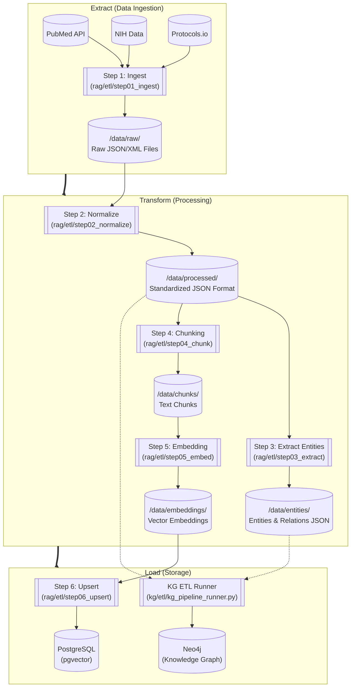
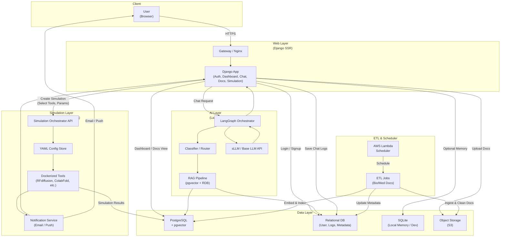
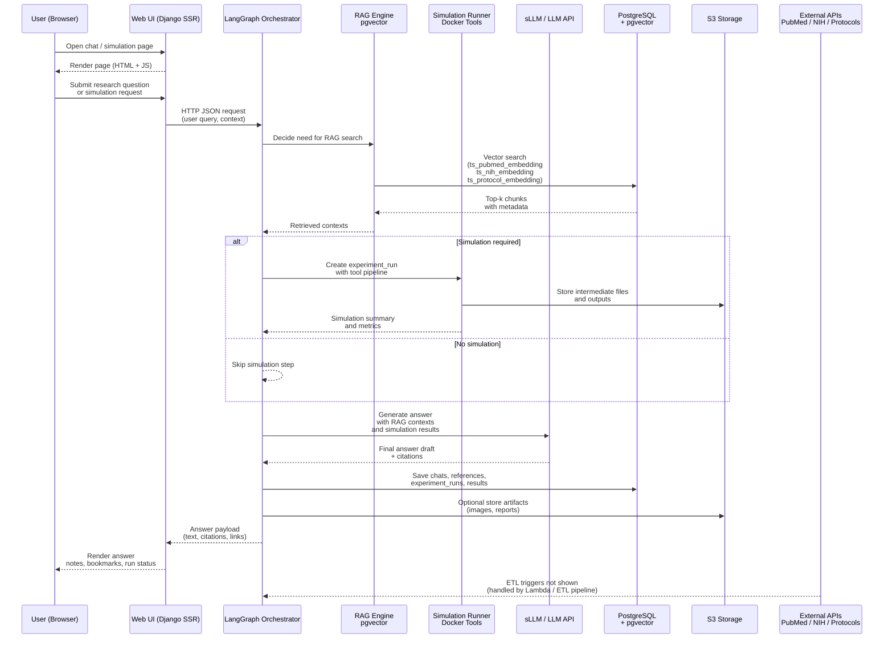

# SKN18-Final-2Team

## [2팀]

| 이름    | 역할   | 세부 역할 |   
|:------: |:-----: |:-------------------: |  
| 황혜진  | PM   | PM, WEB, Infra  |   
| 황민우  | APM   | APM, GraphDB, WEB |   
| 김주석  | 팀원   | 데이터 수집, 전처리, RAGAs |   
| 임승옥  | 팀원   | 데이터 총괄 |    
| 정인하  | 팀원   | LangGraph, sLLM, WEB |   
| 최준호  | 팀원   | 데이터 수집, 전처리 | 

## [주제]

### **🧬 HelixOps**
 > Bio/Med R&D Agentic Platform<br/>
 > 자체 sLLM 개발을 통한 기업 업무 활용 생성형 AI 플랫폼

### 📌 서비스 개요
바이오/제약 기업의 신약 개발 및 연구팀을 대상으로 **문헌 탐색 → AI 기반 후보물질 발굴/시뮬레이션 → 실험 설계 → 실험 결과 해석**의 R&D 전주기를 지원하는 플랫폼입니다. 
논문 내 실험 결과와 이미지 캡션을 학습한 sLLM으로 실험 데이터의 전문적 해석을 자동화하고, AI 예측 및 시뮬레이션 파이프라인과 Hybrid RAG를 하나의 워크스페이스에 통합하여 연구 효율성을 극대화합니다

### **✔ 핵심 목표**
* **최신 논문·임상·프로토콜 기반**의 신뢰 가능한 답변 제공  
* 반복적이고 시간이 많이 드는 문헌 검색·근거 비교 프로세스를 자동화  
* 의료 연구자·의사·대학원생들이 **임상적 판단 근거**를 빠르게 확보할 수 있도록 지원  
* RAG + LangGraph 기반으로 **추론 품질, 신뢰성, 근거 재현성**을 확보  
* PubMed·NIH·Protocols\.io 데이터를 **ETL 파이프라인**으로 구조화
* Neo4j 기반 검색 인프라를 통해 확장 가능한 **연구 지식 데이터 레이크** 구축

### 🎯 타겟 사용자
* Researcher : 의료·바이오 연구자
* Physician Scientist : 신약·비임상 분야 임상의 및 연구 의사
* Medical / Bio Grad Student : 의과대학·생명과학 분야 대학원생
* Clinical Trial Coordinator : 임상시험 및 비임상 연구 코디네이터

### 🎯 타겟 요구사항
* 최신 논문·임상시험·프로토콜을 단일 인터페이스에서 신속히 탐색하고, 출처가 명확한 근거 중심 답변을 필요로 함.
* 논문 구조(Background–Methods–Results–Conclusion) 요약, 연구방법·통계 해석, 발표/보고서용 단계별 요약과 후속 질문 자동 생성 기능이 필요함.
* Eligibility 조건, Inclusion/Exclusion, ECOG·Lab cutoff·Dose/Endpoint 등 핵심 기준을 정확히 정규화·추출해 비교 가능하게 제공하길 요구함.
* 특정 biomarker / target / outcome 기준으로 연관 연구를 교차 검색하고, 근거 스니펫 인용·비교 표 형태로 정리해주길 원함.
* 실험 설계·프로토콜 초안 생성과 결과 해석에 있어 재현 가능한 근거 링크와 버전 관리가 필요함.

## [프로젝트 구조]

```text  
SKN18-FINAL-2TEAM/
├─ README.md
├─ docker-compose.yml               # postgreSQL, pgvector (infra/db/init.sql)
├─ docker-compose.prod.yml
├─ requirements.txt
├─ .env.example
│
├─ .github/
│  └─ workflows/
│     ├─ deploy.yml                 # 🔹 GitHub → ECR → EC2 자동배포
│     └─ ...
│
├─ infra/                           # 인프라/배포 관련
│  ├─ docker/
│  ├─ aws/
│  │  ├─ lambda_functions/
│  │  ├─ cloudformation/
│  │  └─ terraform/
│  ├─ nginx/
│  ├─ neo4j/                       # Neo4j 설정
│  └─ cicd/                        # 🔹 CI/CD 부가 스크립트
│
├─ django_app/                      # Django SSR + API
│  ├─ manage.py
│  ├─ config/                       # settings, urls, wsgi, asgi
│  ├─ apps/
│  │  ├─ accounts/                  # 로그인/회원가입
│  │  ├─ core/
│  │  ├─ dashboard/                 # 메인 대시보드
│  │  ├─ chat/                      # LangGraph 기반 챗봇
│  │  ├─ docs/                      # 문서 관리
│  │  ├─ experiments/               # 실험 시뮬레이션(YAML) 저장/관리
│  │  ├─ notifications/             # 이메일/푸시
│  │  └─ api/                       # REST API (선택)
│  ├─ templates/
│  │  ├─ base.html
│  │  └─ ...
│  ├─ static/
│
├─ graph/                           # LangGraph 오케스트레이션
│  ├─ state.py
│  ├─ nodes/
│  │  ├─ classifier.py              # 질문 분류
│  │  └─ ...
│  └─ entrypoints/
│
├─ rag/                             # RAG + pgvector (문서/논문 기반)
│  ├─ config/
│  │  ├─ db_pgvector.sql
│  │  └─ schema_diagram.md
│  │  
│  ├─ etl/
│  │  ├─ 01_ingest/                         # 1단계: 데이터 "긁어오기"
│  │  ├─ 02_normalize/                     # 2단계: 소스별 raw → 공통 포맷
│  │  ├─ 03_extract/                       # 3단계: 엔터티/관계 추출 (KG용, 선택이지만 중요)
│  │  ├─ 04_chunk/                         # 4단계: 청킹
│  │  ├─ 05_embed/                         # 5단계: 임베딩
│  │  ├─ 06_upsert/                        # 6단계: DB 적재
│  │  ├─ common/                           # ETL 공통 util 모음
│  │  │  ├─ loaders.py                     # raw/processed 파일 로드/저장
│  │  │  └─ ...
│  │  └─ pipeline_runner.py                # 전체 ETL 실행 entrypoint
│  ├─ embeddings/
│  ├─ jobs/
│  └─ tests/
│
├─ kg/                              # Neo4j 기반 Knowledge Graph
│  ├─ schema/
│  │  ├─ nodes.md                   # Protein / Disease / Experiment …
│  │  ├─ relationships.md
│  │  └─ constraints.cypher
│  ├─ etl/
│  │  ├─ 01_from_rag_docs/                   # rag/etl 결과를 입력으로 받는 단계
│  │  │  ├─ 01_load_normalized_docs.py      # rag/etl/02_normalize 결과 로딩
│  │  │  └─ 02_build_base_nodes.py          # Paper / Trial / Protocol 노드 생성
│  │  │
│  │  ├─ 02_from_rag_entities/              # rag/etl/03_extract 결과를 Graph로
│  │  │  ├─ 01_load_entities.py             # _entities.json 로딩
│  │  │  └─ 02_upsert_entities_relations.py # Protein, Disease, 관계 upsert
│  │  │
│  │  ├─ 03_from_sim_results/               # 시뮬레이션 결과 → KG 반영
│  │  │  ├─ 01_load_sim_results.py          # sim_tools 결과 로딩
│  │  │  └─ 02_link_protein_experiment.py   # (Protein)-[HAS_SIM_RESULT]->(Experiment)
│  │  │
│  │  ├─ 04_maintenance/                    # 그래프 유지보수/정리
│  │  │  ├─ 01_apply_constraints.py         # constraints.cypher 실행
│  │  │  └─ 02_recompute_graph_metrics.py   # centrality, degree 등 (선택)
│  │  │
│  │  ├─ common/
│  │  │  ├─ neo4j_client.py                 # Bolt 연결, 세션 관리
│  │  │  ├─ cypher_templates.py             # MERGE, MATCH 쿼리 템플릿
│  │  │  └─ mapping.py                      # internal_doc_format → node schema 매핑
│  │  │
│  │  ├─ kg_pipeline_runner.py              # KG용 전체 파이프 entrypoint
│  │  └─ README_kg_etl.md
│  │
│  ├─ queries/
│  │  ├─ path_queries.cypher
│  │  ├─ analytics.cypher
│  │  └─ graph_analytics.py
│  ├─ src/                                  # KG 관련 유틸리티 및 데이터 로더
│  │  ├─ data_loader.py
│  │  ├─ db_connector.py
│  │  └─ queries.py
│  ├─ vector_search/                        # 벡터 검색 실험 및 평가
│  │  ├─ eval_ab_v5.py
│  │  └─ run_system_a_patched_v4.py
│  └─ tests/
│
├─ sim_tools/                       # 시뮬레이션 도커 툴
│  ├─ base/
│  │  ├─ Dockerfile
│  │  └─ requirements.txt
│  │
│  ├─ alphafold3/
│  │  ├─ Dockerfile
│  │  ├─ config.yml
│  │  ├─ run.sh
│  │  └─ src/main.py
│  │
│  ├─ protein_mpnn/
│  │  ├─ Dockerfile
│  │  ├─ config.yml
│  │  ├─ run.sh
│  │  └─ src/main.py
│  │
│  ├─ rfdiffusion/
│  │  ├─ Dockerfile
│  │  ├─ config.yml
│  │  ├─ run.sh
│  │  └─ src/main.py
│  │
│  └─ common/
│     ├─ io.py
│     ├─ pdb_utils.py
│     └─ types.py
│
├─ sllm/                            # 도메인 특화 LLM (sLLM)
│  ├─ configs/
│  │  ├─ finetune_bio_med.yaml
│  │  └─ inference.yaml
│  ├─ datasets/                     # SFT 멀티턴 QA / 실험 시나리오
│  │  ├─ train/
│  │  └─ eval/
│  ├─ training/
│  │  ├─ preprocess_to_sft.py
│  │  ├─ run_finetune.py
│  │  └─ experiment.ipynb
│  ├─ inference/
│  │  ├─ client_vllm.py
│  │  ├─ client_ollama.py
│  │  └─ router.py
│  └─ tests/
│
├─ jobs/                             # 백그라운드/배치 작업 (서버 사이드)
│  ├─ manage_etl.py                  # Django context + ETL 호출
│  ├─ check_sim_status.py            # 시뮬레이션 컨테이너 상태 체크 후 RDB 업데이트
│  └─ send_notifications.py          # 이메일/푸시 발송 (Lambda에서 호출 가능)
│
├─ scripts/                          # 개발 편의 스크립트
│  ├─ dev_up.sh                      # docker-compose up + migrate
│  ├─ prune_images.sh
│  └─ migrate.sh
│
├─ data/                             # 원천/가공 데이터, 로컬만 (운영에서는 S3)
│  ├─ raw/
│  └─ processed/
│
└─ assets/                           # ERD, Mermaid, 아키텍처 이미지
   └─ architecture/
```

## [도구/기술]

#### **Environment**  
  
  
  


#### **Development**  
  
  
  
  

#### **Database / Infrastructure**  
  
  
  

#### **Communication**  


## [요구사항]

**1️⃣ 데이터 수집 및 전처리 모듈**
- PubMed·NIH·Protocols.io 등 외부 소스에서 문헌/프로토콜 데이터를 안정적으로 수집하고, RAG/분석에 적합한 정제 텍스트로 변환한다.
- 소스별 포맷 차이를 internal_doc_format으로 정규화하고, 중복 제거·클린징·메타데이터(출처/날짜/섹션/키워드) 보존을 보장한다.
- 수집/전처리 결과는 S3에 success/fail + source + date + stage 파티션 구조로 저장하며, fail 데이터는 알림/재처리 대상이 된다.

**2️⃣ 질의 응답 플로우 설계 및 구축 (LangGraph 기반 오케스트레이션)**
- 사용자의 질문을 일관된 흐름으로 처리하기 위해 LangGraph 기반 워크플로우를 설계한다.
- 질문 1건당 하나의 “추론 파이프라인”으로 실행되며, 핵심 노드는 아래 순서를 따른다:
- 메모리 로드 → 질문 분류(논문/임상/프로토콜/결과 해석) → 용어/단위 판별 → RAG 검색(pgvector) → (선택) 그래프 탐색(Neo4j) → 근거 검증/정합성 체크 → 답변 생성(sLLM/LLM) → 인용 스니펫/출처 링크 포함 → 메모리 기록 → 답변 출력
- 답변은 근거 기반(출처/스니펫)으로 제공하며, 후속 질문 추천 및 비교 요약(여러 근거 간 차이) 기능을 포함한다.

**3️⃣ RAG ETL 파이프라인 (pgvector 기반)**
- 정규화된 문서를 청킹(섹션/토큰/오버랩)하고 임베딩을 생성하여 pgvector 인덱스로 업서트하는 ETL 파이프라인을 구축한다.
- ETL 단계는 ingest → normalize → (선택) extract → chunk → embed → upsert로 구성하며, 운영 환경에서는 Lambda를 단계/소스별로 분리 실행할 수 있어야 한다.
- 벡터 검색 품질을 위해 chunk 품질 평가, 인덱스 리빌드, 재처리(run_id 기반) 및 버전 관리(embedding model/version)를 지원한다.

**4️⃣ 웹 UI & 시각화 (Django SSR + JS)**
- 연구자/의사가 사용할 수 있는 웹 UI를 제공하며, “대화 + 근거 + 문서 미리보기 + 요약/비교 결과”를 한 화면에서 확인 가능하게 한다.
- 주요 화면: 채팅(근거 하이라이트/출처 링크), 문서/프로토콜 탐색, 임상시험 요약(Eligibility/Outcome 구조화), 실험 결과 해석(초안/검증 포인트), 히스토리/북마크.
- 관리 기능: 데이터 적재 현황, ETL 성공/실패 로그, 모델 버전, 인덱스 상태, 재처리 트리거 제공.

**5️⃣ 관측·품질·로그 (Observability & Quality Tracking)**
- 질문→검색→답변 전 과정을 추적 가능하게 하여 “어떤 질문에 어떤 근거로 어떤 답이 나갔는지”를 재현할 수 있어야 한다.
- 품질 지표(논리성/정확성 점수, 근거 일치도, hallucination 의심 신호)와 운영 지표(ETL 처리량/실패율/시간, Lambda 실행 시간, 비용)를 기록한다.
- 실패(fail prefix) 데이터는 자동 알림(Slack/Discord/SNS)과 재처리 워크플로우로 연결되며, 단계별 원인(ingest/normalize/chunk/embed/upsert)을 구분해 대응할 수 있어야 한다.


## [수집 데이터]
**1. PubMed 논문 전문 및 메타데이터**
- Source: PMC (PubMed Central) Open Access Subset
- URL: https://pmc.ncbi.nlm.nih.gov/tools/oai/
- Format: JSON
- Description:
   PubMed Open Access 논문 전문 및 메타데이터를 수집하여 RAG 학습 및 검색에 활용한다.
   제공된 분류 체계를 기반으로 키워드를 확장하여 키워드별 약 200편의 논문을 수집한다.
- Target Domains:
  1) Protein Structure & Enzyme Engineering
  2) Cancer Biology & Oncology
  3) AI-based Modeling & Design
  4) Cell & Molecular Mechanisms
  5) Omics & Systems Biology

**2. Experimental Protocols**
- Source: Protocols.io API
- API Endpoints:
  - v3: https://www.protocols.io/api/v3/protocols
  - v4: https://www.protocols.io/api/v4/protocols/{protocol_id_or_uri}
- Format: CSV
- Description:
   - 실험 프로토콜 메타데이터(v3)와 상세 실험 절차(v4)를 단계(step), 시약·장비 정보, HTML 본문 형태로 수집한다.
   - 문헌 기반 실험 재현성과 프로토콜 이해를 지원하기 위한 데이터 소스이다.

**3. Clinical Trials**
- Source: ClinicalTrials.gov (National Library of Medicine)
- URL: https://clinicaltrials.gov/data-api/api#refs
- Format: JSON
- Description:
   - 2023–2025년 기간 동안 한국·미국·일본의 주요 질환군에 대한 임상시험 데이터를 수집하여 Eligibility 조건, Outcome, Trial Design 분석에 활용한다.
- Coverage:
   Diseases: Neoplasms, Autoimmune Diseases, Cardiovascular Diseases
- Countries & Volume:
   - Korea: 약 3,584 cases
   - United States: 약 31,884 cases
   - Japan: 약 2,450 cases
  
**4. Knowledge Graph (PrimeKG)**
- Source: mims-Harvard / PrimeKG
- URL: https://github.com/mims-harvard/PrimeKG
- Format: CSV / TSV
- Description:
   - 대규모 생의학 논문과 공개 데이터베이스를 기반으로 구축된 질병–약물–유전자–경로 관계형 지식 그래프이다.
   - 논문 기반 근거를 구조화하여 관계 추론과 탐색이 가능하도록 제공한다.
- Purpose:
  - 논문 기반 질병·약물·유전자 간 관계 추출 및 근거 중심 분석
- Strategy:
  - PrimeKG 엔티티·관계 데이터를 Neo4j Knowledge Graph로 Import하여 그래프 탐색 및 추론에 활용
- Use Cases:
   - 연구 근거 탐색 및 가설 수립
   - 타겟–질병–약물 관계 분석
   - 실험 설계 및 후보 타겟 우선순위 도출

## [화면 설계]

- **도구** : Figma, HTML, CSS, Javascript


# [설계]

## 1. ETL



## 2. **시스템 구성 및 흐름도**



- 시퀀스 다이어그램(Sequence Diagram)


## [구현]

### 1. Hybrid RAG
 - **목적**: 데이터 전처리~ 임베딩(ETL) 모듈화 및 진행 후 유저의 질문의 유사도가 높은 청킹데이터 추출  
 - **결과**: ETL 파이프라인 구축, 유사도 테스트를 통한 질문과 관련성 높은 청킹 추출  
 
#### 1) ETL  


#### 2) Database (Graph + VectorDB)  
- 

#### 3) retriver  


#### 4) evaluation  


## 2. LangGraph
- **역할** : **전체 AI 파이프라인을 오케스트레이션(orchestration)** 하는 핵심 엔진 (운영, 실험, 안전, 재시도 등)
- **목적**:  
  `langgraph` 워크플로우로 의료 특화 Self-RAG 파이프라인을 구성해 질문 유형에 따라 사용자 정보·비의학·의학 질문을 자동 라우팅하고, 용어 질문은 WebSearch, 일반 의학 질문은 RAG 검색으로 보내도록 설계
- **워크플로우 :** 메모리 → 질문 분류 → 용어 판별 → 검색/웹서치 → 검증 → 답변 → 메모리 기록  
- **노드 별 기능**  
  - **memory_read** : sqlite3에 저장된 기존 대화내역 전달(user_info는 5개, medical은 1개)  
  - **classifier** : 사용자의 질문을 medical, user_info, none_medical로 분류  
  - **medical_check** : vectorDB / Websearch 대상(의학 용어)인지 판별  
  - **retriver** : vectorDB에서 유사도 검색을 통해 유사도 높은 청크 5개 추출  
    **evaluate_chunk** : 추출된 5개의 청크가 원본질문과 연관성이 있는지 llm이 판단하여 점수 부여.  
  		       재작성 후 추출된 모든 청크가 질문과 관련이 없는 경우  최종 메세지와 함께 END  
    **rewrite_query** : evaluate_chunk에서 낮은 점수가 나오면 llm이 질문을 재작성하여 retriver로 전달(최대 1번)  
  - **WebSearch** : Tavily를 사용해 의학 용어 정의 검색  
  - **Generate_answer** : 답변 형식 고정, llm 판단 점수출력, 출처 추출  
  - **memory_write** : 질문과 Generate_answer에서 생성된 답변 원본과 summary, 채팅창 아이디(conversation_id)를 sqlite3에 저장

- **메모리 시스템**
  - LLM 에이전트는 기본적으로 금붕어 뇌와 같아서, 그래프가 한 턴 실행될 때마다 바로 전 문장도 잊어버리는 특성
  - MemorySaver는 이 에이전트에게 블랙박스(기억 장치)를 달아주는 역할
  - 각 대화에서 중요한 순간만 캡처해 저장하고, 다음 턴에서 필요할 때만 적절히 불러와 사고 흐름에 삽입
  - **결론** : 에이전트는 이전 대화를 전부 기억하지 않아도 안정적인 추론 흐름을 유지 가능
    
[ LangGraph 흐름도]  

  - **구상** 
    - {excalidraw 이미지 }
  
  - **구현**
   - {이미지 }  


### 3. WEB

- **목적** : AI 기반 연구지원 플랫폼의 웹 인터페이스를 구현하여, 사용자 인증·대화 이력 관리·데이터 시각화 등을 통합적으로 제공한다.  
- **도구** : Django Framework (SSR 기반 MVT 구조)  
  - Django의 MVT(Model–View–Template) 패턴을 사용  
  - 서버에서 HTML을 렌더링하는 **SSR(Server-Side Rendering)** 방식으로 화면을 제공  
- **핵심 기능**:  
  - 인증 / 가입  
    - 로그인, 회원가입, 프로필 관리 (django.contrib.auth)
    - 사용자 활동 로그(audit) 및 접속 기록 추적
  - 대시보드 (Dashboard)
    - 전체 대화량, 정확도, RAG 활용 비율 등 주요 지표 시각화
    - 사용자별 최근 활동 및 통계 제공
  - AI 대화 기능 (Chat)
    - LangGraph 기반 챗봇 인터페이스 및 히스토리 저장
    - 참고 문헌(Reference) 및 근거 기반 답변 표시
    - 메시지 피드백(좋아요/싫어요) 및 사유 수집
    - AI 생성 컨셉 그래프(Mermaid) 시각화 및 후속 질문 추천
  - 일정 및 알림 (Schedule & Notifications)
    - 연구/실험 일정 관리 (FullCalendar 연동)
    - 시스템 알림 및 메시지 수신
  - 실험 시뮬레이션 (Experiments)
    - AlphaFold3, ProteinMPNN, RFDiffusion 등 바이오 모델 기반 시뮬레이션 지원
    - 실험 파라미터(YAML) 설정 및 Docker 컨테이너 실행 요청
    - 실험 상태 모니터링 및 결과 데이터(PDB 구조 등) 조회/다운로드
  - 연구 노트 및 실험 관리 (Notes & Experiments)
    - AI 대화 내용 기반 연구 노트 작성 및 저장
    - 실험 시뮬레이션(AlphaFold3 등) 설정 및 결과 관리


- **주요 모델** :   
  - **Account**: `User` (커스텀 사용자), `UserActivityLog` (활동 로그)
  - **Chat**: `Chat` (대화 세션), `ChatMessage` (메시지), `ChatReference` (참고문헌), `ChatMessageFeedback` (피드백), `PaperGraph` (논문 그래프)
  - **Note**: `Note` (연구 노트 본문/메타데이터)
  - **Experiment**: `Experiment` (실험 설정 및 결과)
  - **Schedule**: `Event` (일정 이벤트)

- **주요 API**   
  - **Accounts**: `/accounts/login/`, `/accounts/register/`, `/accounts/profile/`
  - **Chat**: 
    - `/chat/api/conversations/` (대화 목록/생성)
    - `/chat/api/messages/` (메시지 전송/조회)
    - `/chat/api/feedback/` (피드백 등록)
  - **Dashboard**: `/dashboard/` (통계 데이터 렌더링)
  - **Note**: `/notes/` (노트 CRUD)
  
- **향후 개선 방향**:  
  - 2차 개발 예정
    - 소셜 인증/가입/비밀번호 찾기
    - 알림 시스템 (Notification 도입)
    - 실험 데이터 시각화 도구(3D MolStar 등) 웹 통합 강화
    - 관리자 페이지(Admin) 대시보드 고도화

## [평가/결과]
- 최종 발표 예정

## [인사이트]
- 최종 발표 예정

## [이슈]
- Github Issues
  - https://github.com/SKNETWORKS-FAMILY-AICAMP/SKN18-FINAL-2TEAM/issues?q=is%3Aissue


